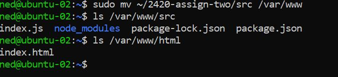

Linux Assignment 2
===============

Load Balancer IP address: http://24.199.71.51

The following Steps to this README.md are completed by Hened Medina (A01248005)


Step 1
-------
**Note:** This steps assumes that the user knows how to generate an ssh key and add it to Digital Ocean. If not you can find the video [here](https://vimeo.com/758870226/f75da348fc?embedded=true&source=video_title&owner=17609105) 

Following this video [here](https://vimeo.com/775412708/4a219b37e7) to setup your VPC (Virtual Private Cloud), 2 Droplets, Load Balancer, and Firewall.

Refer to the photos below and ensure you have these results for your VPC, Load Balancer, and Firewall. 


Step 2
-------
1. Create a new regular user on your two new Droplets created in Step 1. 
**Tip:** Use the same user-name and password for both droplets

**The following commands are to be done on each Droplet**
2. Use command `ssh -i ~/.<key> root@<server_ip>` to login as root to  

3. Use command `useradd -ms /bin/bash <user_name>` to use bash as their default shell

4. Use command `usermod -aG sudo <user_name>` to add the user to the sudo group

5. Use command `rsync --archive --chown=<ned>:<ned> ~/.ssh /home/<user_name>` to move the user

6. Use command `passwd <user_name>` to set a password for the user

7. Use command `exit` to exit out of the Droplet once you're done


Step 3
-------
1. ssh into each Droplet update them with the commands `sudo apt update` then `sudo apt upgrade` afterwards
**Note**: Ensure to do all of the commands in this step on BOTH servers like the examples below


2. Install Caddy using command 
```
wget https://github.com/caddyserver/caddy/releases/download/v2.6.2/caddy_2.6.2_linux_amd64.tar.gz
```


3. To unarchive the tar.gz, run:
```
tar xvf caddy_2.6.2_linux_amd64.tar.gz
```


4. Use the command `sudo chown root: caddy` and `sudo cp caddy /usr/bin/` to change the ownder of the caddy file and move it to /usr/bin/


Step 4
-------
1. In WSL, in your users home directory, create a new directory called '2420-assign-two'
2. Once created, `cd` into it and create two new directories called 'html' and 'src'


3. Within the html directory, run `vim index.html` and add some content to it


4. Now `cd` into the src directory and run `npm init` to create a new node project, then `npm i fastify` to install fastify

5. Create an index.js file and insert the fastify hello world example into index.js


6. Test to see if the server works locally with command `node index`


7. Afterwards, change the index.js file to add reverse proxy server of localhost:5050 and the route to /api


**Note**: You can test to see if the changes have been made


8. Move the files from WSL to the **TWO** droplets using commands `sftp i- ~/.ssh/<key> <user_name>@<server_ip>

Then use the following command in each server
```
put -r 2420-assign-two
```

9. For **EACH** Droplet, run the commands in the screenshots to move the files to their correct directories





Step 5
-------
1. In WSL, create the Caddyfile using `vim Caddyfile`

3. Add the content below


3. Move the Caddyfile from WSL to the **TWO** droplets using commands `sftp i- ~/.ssh/<key> <user_name>@<server_ip>`


4. ON **EACH** Droplet, move the Caddyfile to /etc/caddy using `sudo mv Caddyfile /etc/caddy`

5. In WSL, create a caddy.service file with `vim caddy.service`

6. Move the caddy.service from WSL to the **TWO** droplets using commands `sftp i- ~/.ssh/<key> <user_name>@<server_ip>`


**Note:** Ensure that the `caddy.service` file is in the directory /etc/systemd/system

Do this using command `sudo mv caddy.service /etc/systemd/system` in **EACH** Droplet


7. Use the commands below to restart and enable the service file
```
sudo systemctl daemon-reload
sudo systemctl start caddy
sudo systemctl enable caddy
sudo systemctl status caddy
```

Step 6
-------
1. Install Volta on **EACH** Droplet with the following comamnds:
```
curl https://get.volta.sh | bash
source ~/.bashrc
volta install node 
volta install npm
```


Step 7
-------
1. Create a service file in WSL and add the content below


2. Move the hello_web.service from WSL to the **TWO** droplets using commands `sftp i- ~/.ssh/<key> <user_name>@<server_ip>

3. In **EACH** Droplet, move the `hello_web.service` file to the directory `/etc/systemd/system`


4. Reload the file with the commands

```
sudo systemctl daemon-reload
sudo systemctl start hello_web
sudo systemctl enable hello_web
```

Step 8
-------
1. In **ONE** of the Droplets, slightly change your index.html file in `/var/www/html` and your index.js in `/var/www/src` to differentiate the two servers


Step 9
------
1. Test the load balancer by using your load balancers ip address and refreshing it multiple times. 
2. Test the load balancer by using your load balancers ip address followed by `/api` and refreshing it multiple times.


If you see the changes you made to your index.html and index.js file, then Good Job!

*Congrats! You are now done! :)*


