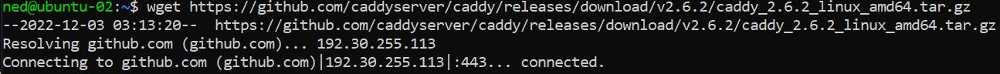

Linux Assignment 2
===============

Load Balancer IP address: http://24.199.71.51

The following Steps to this README.md are completed by Hened Medina (A01248005)


Step 1
-------
**Note:** This steps assumes that the user knows how to generate an ssh key and add it to Digital Ocean. If not you can find the video [here](https://vimeo.com/758870226/f75da348fc?embedded=true&source=video_title&owner=17609105) 

Following this video [here](https://vimeo.com/775412708/4a219b37e7) to setup your VPC (Virtual Private Cloud), 2 Droplets, Load Balancer, and Firewall.

Refer to the photos below and ensure you have these results for your VPC, Load Balancer, and Firewall. 


Step 2
-------
1. Create a new regular user on your two new Droplets created in Step 1. 
**Tip:** Use the same user-name and password for both droplets

**The following commands are to be done on each Droplet**
2. Use command `ssh -i ~/.<key> root@<server_ip>` to login as root to  
3. Use command `useradd -ms /bin/bash <user_name>` to use bash as their default shell
4. Use command `usermod -aG sudo <user_name>` to add the user to the sudo group
5. Use command `rsync --archive --chown=<ned>:<ned> ~/.ssh /home/<user_name>` to move the user
6. Use command `passwd <user_name>` to set a password for the user

7. Use command `exit` to exit out of the Droplet once you're done


Step 3
-------
1. ssh into each Droplet update them with the commands `sudo apt update` then `sudo apt upgrade` afterwards
**Note**: Ensure to do all of the commands in this step on BOTH servers like the examples below


2. Install Caddy using command 
```
wget https://github.com/caddyserver/caddy/releases/download/v2.6.2/caddy_2.6.2_linux_amd64.tar.gz
```


3. To unarchive the tar.gz, run:
```
tar xvf caddy_2.6.2_linux_amd64.tar.gz
```


4. Use the command `sudo chown root: caddy` and `sudo cp caddy /usr/bin/` to change the ownder of the caddy file and move it to /usr/bin/


Step 4
-------
1. In WSL, in your users home directory, create a new directory called '2420-assign-two'
2. Once created, `cd` into it and create two new directories called 'html' and 'src'


3. Within the html directory, run `vim index.html` and add some content to it


4. Now `cd` into the src directory and run `npm init` to create a new node project, then `npm i fastify` to install fastify

5. Create an index.js file and insert the fastify hello world example into index.js


6. Test to see if the server works locally with command `node index`


7. Afterwards, change the index.js file to add reverse proxy server of localhost:5050 and the route to /api

**Note**: You can test to see if the changes have been made


8. Move the files from WSL to the two droplets using `sftp i- ~/.ssh/<key> user_name@
